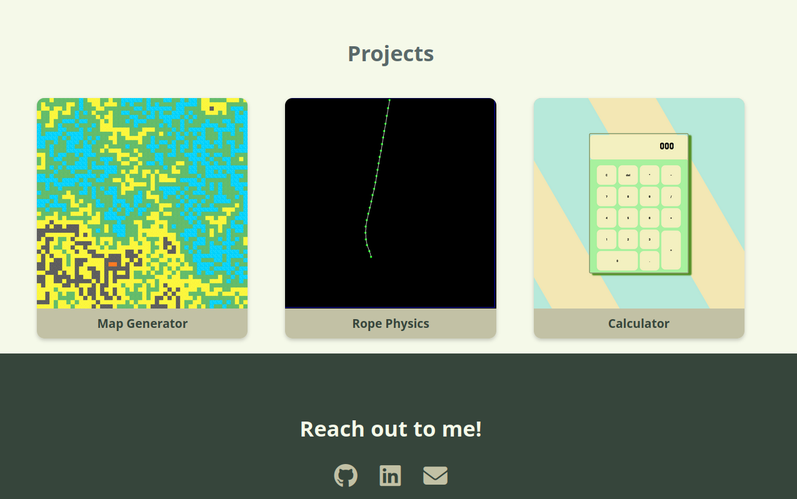

# Personal Portfolio Website

This is my personal portfolio website built using basic **HTML** and **CSS**.  
It serves as a showcase of my **skills, projects, and contact links** in a simple and responsive design.

---

## Overview

The website consists of four main sections:
1. **About** – A brief introduction about me and my interests in programming.  
2. **Skills** – Technologies and languages I’m learning or familiar with.  
3. **Projects** – A collection of small projects I’ve built and showcased with screenshots.  
4. **Contact** – Links to my GitHub, LinkedIn, and email for easy reach.

---

## Tech Stack and features

- **HTML5** – Structure of the website  
- **CSS3** – Styling and layout  
- **Font Awesome** – Icons for skills and social links  
- **Responsive Design** – Works well across devices

---
## Deployment

This portfolio is hosted using **GitHub Pages**.  
You can view it live [here](https://gk-y.github.io/Portfolio/).

---

## Webpage

---
